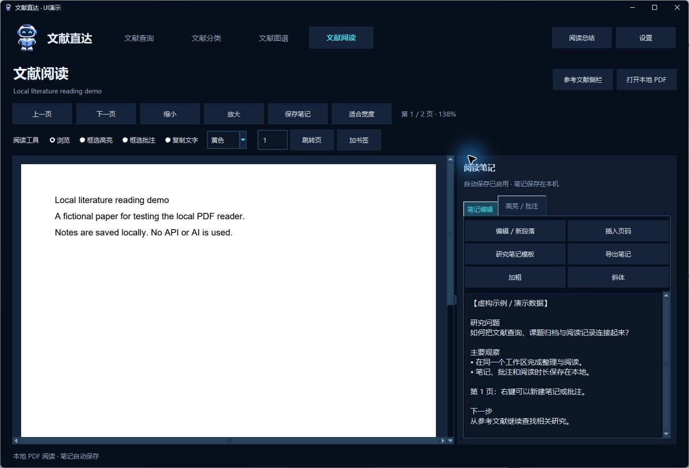
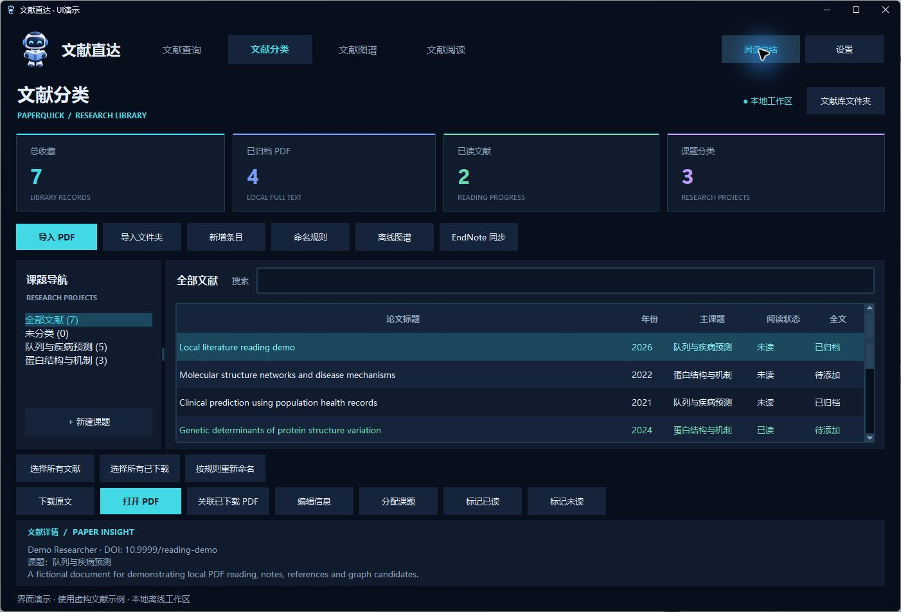
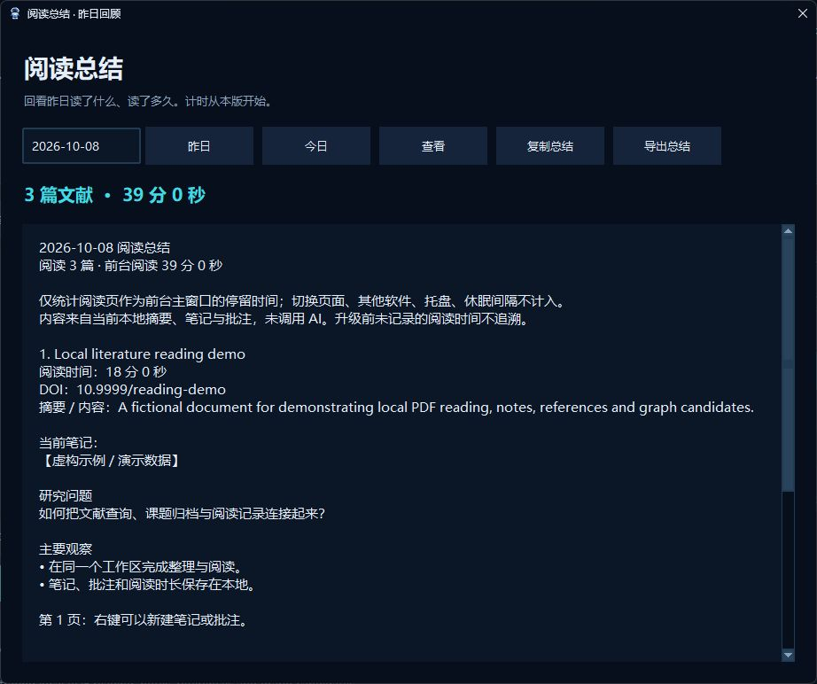

# 文献直达 · PaperQuick 3.1

从导师发来的一个标题，到课题文件夹里的一篇论文，再到阅读笔记和每日回顾。Windows 本地文献工作区，连接 **查询 → 下载归档 → 分类 → 阅读批注 → 关系图谱 → 阅读总结**。

[下载 Windows 版](https://github.com/J0ey2ou/PaperQuick/releases/latest) · [English](#english) · [参与协作](CONTRIBUTING.md) · [微信介绍与截图](推送文案.md)

无需安装 Python，无需注册账号。整理、阅读、图谱和总结在本机完成，不调用外部 AI、不需要 AI API Key；检索和下载需要联网。

## 安装与升级

1. 在 Releases 下载 `PaperQuick-v3.1-Windows.zip`，解压完整文件夹到可写目录。
2. 双击 `文献直达.exe`，保留同目录的 `全局选词助手.exe`、`browser-extension` 和说明文件。
3. 复制一个英文标题或 DOI，在 **文献查询 → 粘贴并查找** 试用。
4. 升级时先从托盘 **退出文献直达**，备份原文件夹，再覆盖程序文件。保留 `本地文献库`、`settings.json`、`shortcut.json`，不要用空库替换旧库。备份请在退出后复制完整 `本地文献库`，其中包含数据库及 PDF。

面向 Windows 10 / 11 64 位。发布包不含个人文献或演示库；截图中的文献与阅读时长均为虚构演示。

## 查询：三种入口

- **粘贴查询**：支持完整英文论文标题、DOI、arXiv 编号 / 链接和可读取的推送链接。粘贴后点击查找，或按 `Ctrl + Enter`。结果逐步显示，可核对作者、年份和 DOI，再打开或复制地址。
- **Word / PDF / 微信电脑版选词**：启动全局选词助手，选中可复制文字，按托盘显示的快捷键。右上角 **设置 → 快捷键 → 保存并启用** 可修改，例如 `Ctrl + Alt + J`。默认先尝试 `Ctrl + Alt + F`；占用时使用备用键，以实际显示为准。系统范围使用快捷键，原生应用没有统一右键菜单。
- **Edge / Chrome 右键**：打开 `edge://extensions` / `chrome://extensions`，开启开发者模式，加载解压后的 `browser-extension`。选中标题 / DOI，右键 **查找文献并打开原文**。当前推送页面也可右键查询；扩展独立运行，桌面端负责本地文献库。更新扩展后点击重新加载。

单个 DOI / arXiv 有直接入口时可先打开；匹配明确的标题查询可自动打开。服务缓慢时使用 **直接学术搜索**。遇到公众号验证，先在浏览器完成验证，再选中英文标题 / DOI；软件不绕过验证或机构付费权限。

## 下载、课题分类和命名

1. 查询结果点击 **收藏 / 下载归档**，选择或新建课题。可下载的直接 PDF 自动归档；需要网页操作时打开对应全文 / 出版社页面。
2. **文献分类** 支持导入 PDF、导入文件夹、手工新增及编辑元数据。右键 **下载原文（打开下载页面）** 跳转对应页面；**下载并自动归档** 查找开放版本并保存。
3. 浏览器完成机构登录并下载的 PDF，通过 **关联已下载 PDF** 或 **导入 PDF** 归档。当前不监控浏览器下载目录，不会猜测新下载文件属于哪篇文献。
4. **命名规则** 支持 `{年份}`、`{第一作者}`、`{标题}`、`{DOI}`、`{课题}`，例如 `{年份}_{第一作者}_{标题}`。英文占位符也可用：`{year}_{author}_{title}`。
5. 选中文献后右键 **按规则重新命名**。可使用 **选择所有文献 / 选择所有已下载文献**（全库范围，会清除筛选），或 Ctrl / Shift 多选。确认预览后批量应用各条目主课题的规则。无 PDF 条目跳过，同名文件自动加后缀；修改管理库内附件，原始导入文件不改动。

## 阅读、笔记、批注和参考文献

- 从分类、图谱等内部入口打开 PDF，进入 **文献阅读**。支持翻页、跳页、适合宽度、缩放和书签。
- 右侧笔记可直接编辑、撤销 / 重做、加粗、斜体、插入页码、插入研究笔记模板及导出。编辑后自动保存，也可点击 **保存笔记** 或在笔记区按 Ctrl+S。
- **阅读区右键 → 添加阅读笔记**，快速插入当前页记录；有当前页最近框选文字时一并带入。右键还可在点击位置添加批注和书签。
- 阅读工具支持 **框选高亮 / 框选批注 / 复制文字**，拖出选区即可操作；批注列表支持定位、编辑、删除，颜色可选。
- **参考文献侧栏** 可独立打开。优先保留原始编号；显示 `1*` 等星号时只是提取顺序，原编号未识别，请回原文核对。条目可查原文、下载归档或收藏到课题。
- 笔记、书签和批注存放在本地库，PDF 原文件不改写，其他阅读器不会自动显示本软件批注。扫描版 PDF 和复杂分栏可能无法正确提取文字或引用，当前不内置 OCR。

## 离线图谱

**收藏概览** 查看课题分布；**文献关系** 查看标题、摘要、关键词的文本相似关系及本地 PDF 中的 DOI 引用证据。

拖动文献数滑条控制密度；滚轮缩放，拖动空白区平移，Shift 框选区域放大，双击节点聚焦邻居，重置视图返回全局。点击概览的课题区域可查看对应部分。节点详情可继续打开 PDF、查询原文或收藏候选。

未入库候选来自本地参考文献，以虚线区分，并非在线全领域推荐。高亮可按阅读次数、本地引用次数、是否下载，或自定义颜色和权重。**本地引用次数不等于全球被引次数**，文本相似也不代表已验证的学术引用。

## 阅读总结：昨天实际读了什么

点击标题栏 **阅读总结**，以独立弹窗展示昨天的阅读情况，也可选择今日或其他日期。主页面保持原位，关闭弹窗继续阅读；后台启动不主动弹出。汇总去重阅读篇数、每篇时长、总时长，以及当前本地摘要、笔记和摘录；支持复制和导出。

只有 **文献阅读页处于前台主窗口且 PDF 已加载** 才累计时间。切换页面、其他软件、最小化或隐藏到托盘时暂停，休眠或长时间阻塞的间隔不计。采用约 1 秒采样，计量前台停留时间，不推断视线或专注度；从新版开始记录，不能补算升级前时长。内容基于已有资料，不是 AI 生成摘要，也不是历史笔记快照。

## 设置、皮肤和后台运行

右上角 **设置** 是独立页面，支持 **深空蓝 / 极光紫 / 石墨灰 / 极简浅色**，切换立即预览，保存后下次沿用。可设置快捷键、可选 Unpaywall 联系邮箱、**登录 Windows 后后台启动**。

关闭主窗口收起到系统托盘，双击托盘恢复；右键托盘可打开文献库、设置或完整退出。重复启动唤起同一窗口。启用 Windows 登录启动后先驻留后台，可在设置取消。没有账号登录体系或鼠标跟随浮窗。

## EndNote 兼容范围

针对 EndNote 22.3 提供只读导入、附件归档、差异 / 冲突预览及 XML 交换包。请先用备份库测试，保留 `.enl` 和对应 `.Data`。

**已有 EndNote 记录的全自动双向写回尚未实现。** 当前可以从 EndNote 导入本地、导出本地修改及 XML 交换清单，再在 EndNote 中导入或人工核对已有记录；导入完整库可能产生重复。软件不直接修改 EndNote 私有数据库。本软件笔记、图谱、批注和计时不会自动同步为 EndNote 对应功能。

## 数据与网络

文献库、PDF、笔记、批注及阅读时长保存在程序目录的 `本地文献库`。检索会将标题 / DOI 发送给文献服务，网页链接会向目标站点请求；可选 Unpaywall 邮箱随 DOI 查询发送给该服务。离线功能不上传正文。服务可能限流、验证或没有开放全文，原文入口不保证免费 PDF。

## 公开协作

欢迎在 [Issues](https://github.com/J0ey2ou/PaperQuick/issues) 反馈问题，在 [Discussions](https://github.com/J0ey2ou/PaperQuick/discussions) 讨论，或 Fork 后提交 PR。见 [协作指南](CONTRIBUTING.md)。所有者可在 [协作者设置](https://github.com/J0ey2ou/PaperQuick/settings/access) 邀请 GitHub 用户；发送仓库链接本身不赋予写权限。

## English

**PaperQuick 3.1** is a local Windows literature workspace: search, archive PDFs by research project, read and annotate, explore relationships, and review yesterday's reading. The Windows package needs no Python installation or account. Local organization, reading, graphs and recaps use no external AI or AI API key. Search and download require internet access.

### Install and update

Download `PaperQuick-v3.1-Windows.zip` from [Releases](https://github.com/J0ey2ou/PaperQuick/releases/latest), extract the entire folder and run `文献直达.exe` on Windows 10/11 x64. Keep the helper and extension alongside it. Exit from the tray before updating, back up the folder, then replace program files while retaining `本地文献库`, `settings.json` and `shortcut.json`. Back up the whole library while the application is closed.

### Practical workflow

1. **Search**: paste an English title, DOI, arXiv identifier or readable article link, then search or press Ctrl+Enter. Verify metadata before collecting. Direct Scholar search is available when services are slow. Complete WeChat page verification in your browser before selecting the English title / DOI.
2. **Selected text**: start the helper, select copyable text in Word/PDF/WeChat and press the configured shortcut. Change it in top-right Settings (e.g. Ctrl+Alt+J); the tray shows the active combination. For browser right-click, enable developer mode at `edge://extensions` or `chrome://extensions` and load `browser-extension` unpacked. Desktop apps use hotkeys, not a universal right-click menu.
3. **Download**: click `收藏 / 下载归档`, choose/create a project. Direct PDFs archive automatically; otherwise the relevant full-text/publisher page opens. Library right-click offers download-page navigation or automatic download and archiving. Manually downloaded subscription PDFs must be attached/imported; browser downloads are not monitored.
4. **Rename**: configure `{year}_{author}_{title}` or Chinese tokens `{年份}_{第一作者}_{标题}`. Right-click selected records to rename managed attachments. Buttons select all records or all downloaded records across the entire library, clearing filters. Review the preview; missing PDFs are skipped and filename collisions receive suffixes. Original source files are preserved.
5. **Read**: internal PDF actions open the reader. Notes autosave and support formatting, page markers, templates and export. Right-click the PDF to add a note, comment or bookmark. Drag regions to highlight, comment or copy text. Annotations live in the database, not inside the original PDF.
6. **References**: open the detachable panel. Original numbers are retained where recognized; `1*` indicates extraction order only. Verify before searching, collecting or downloading. Scans and complex layouts may need manual correction; OCR is not included.
7. **Graph**: node-count slider, wheel zoom, blank-area pan, Shift box zoom, double-click neighborhood focus and reset. Candidates come from local references. Highlight by reading count, local citation count or PDF availability, with configurable colors/weights. Local citation counts are not global metrics.
8. **Recap popup**: the title-bar `阅读总结` button opens a separate window for yesterday, today or a selected date, with distinct papers, duration, current abstracts/notes/excerpts. The main page stays in place; background startup does not interrupt you. Copy or export the report. Only a loaded reader in the foreground main window counts; other pages/apps, tray and suspend gaps do not. Sampling is about one second and measures dwell time rather than attention. Pre-upgrade time is not inferred. Content is neither AI-written nor a historical snapshot.
9. **Settings**: Space Blue, Aurora Purple, Graphite and Light themes preview immediately; save to persist. Configure shortcuts, optional Unpaywall email and Windows sign-in background startup. Close hides to tray; double-click restores; tray Exit fully quits. No mouse-following overlay or local account system.

### EndNote, privacy and collaboration

EndNote 22.3 support covers read-only import, attachment archiving, conflict previews and XML exchange. **Automatic write-back to existing EndNote records is not implemented.** Review exported changes manually; importing an entire exchange library may duplicate records. Keep backups of both `.enl` and `.Data`. PaperQuick notes, annotations, graphs and reading time do not automatically become EndNote features.

Search sends titles/DOIs to services and requests supplied URLs; optional Unpaywall email accompanies its queries. Offline features do not upload library contents. Full-text access depends on permissions, availability and service limits. Contribute through Issues, Discussions or fork/PR; see [CONTRIBUTING.md](CONTRIBUTING.md).
