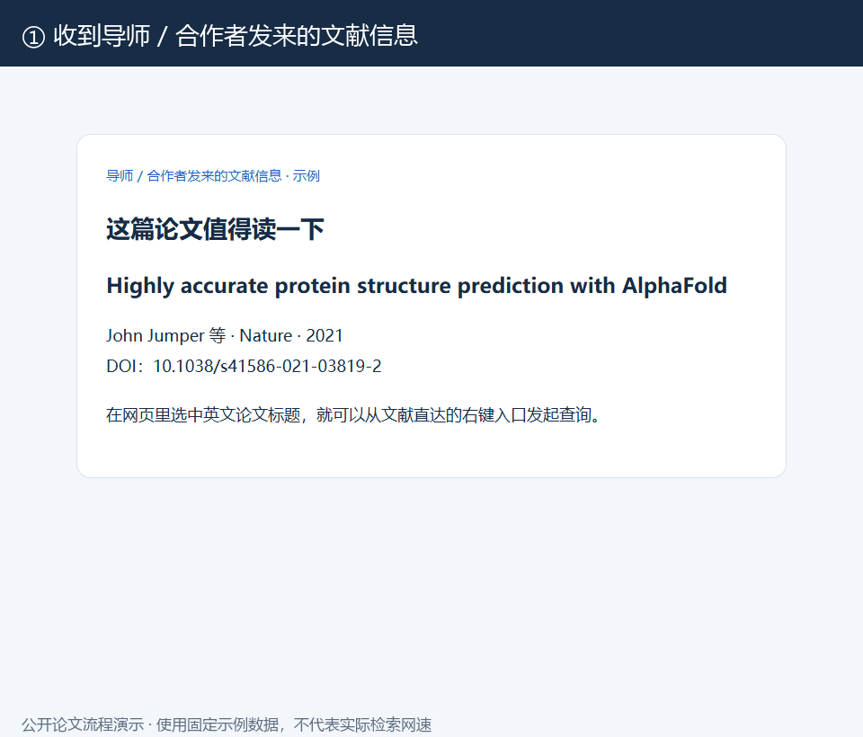
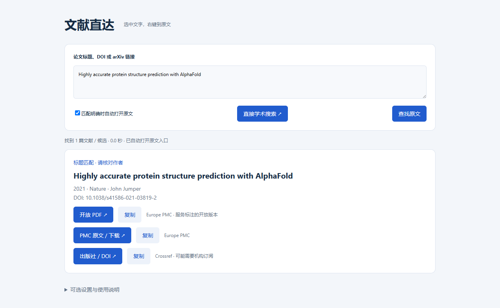

# 导师发来的论文，选一下就能找到原文入口

导师发来一段文献引用，合作者转来一篇科研推送，群里又有人推荐了一篇论文。真正开始阅读前，常常还要做一串重复操作：复制标题、切换窗口、搜索、核对论文，再找 PDF 或全文入口。

我做了一个小工具「**文献直达 · PaperQuick**」，把这些步骤接起来。收到文献信息后，尽量在当前阅读场景里完成查询，把时间留给读论文。

## 选一次，自动接起后面的检索流程

**选中英文论文标题 / DOI → 右键或按一次快捷键 → 自动匹配论文 → 查找原文入口 → 匹配明确时自动打开网站。**

支持完整英文论文标题、DOI、arXiv 编号 / 链接，也支持可以读取正文的科研推送链接。结果里会显示标题、作者、年份和原文链接，方便核对；同名、近似或多篇候选时，由你确认后再打开。

## 三种用法，接上你已有的阅读习惯

### ① 复制文献信息，粘贴并查找

打开桌面软件，复制标题、DOI 或链接，点击 **“粘贴并查找”**。也可以手动粘贴后点 **“查找原文”**，或按 **Ctrl + Enter**。开放 PDF、全文页和出版社入口会陆续显示，链接出现就可以点击；单个链接、全部结果都能复制。

### ② Word / PDF / 微信电脑版，选中后按快捷键

点击软件里的 **“全局快捷键”**，或者双击 **“全局选词助手.exe”**，助手会驻留系统托盘。回到原软件，选中可复制的英文论文标题或 DOI，按状态栏 / 托盘显示的组合键，就能发起查询。无需每次先打开软件再粘贴。

### ③ Edge / Chrome 网页里，选中后右键

在地址栏打开 **edge://extensions** 或 **chrome://extensions**，开启开发者模式，选择 **“加载已解压的扩展”**，加载软件包里的 **browser-extension** 文件夹。之后选中标题 / DOI，右键选择 **“查找文献并打开原文”** 即可。

也可以在已打开的推送页面右键 **“查找当前页面中的论文”**，或点击扩展图标。浏览器扩展独立工作，无需先启动桌面软件；更新文件后，在扩展管理页点 **“重新加载”**。

## 从下载到第一次查询，只需这几步

1. 打开下方 GitHub 下载页，下载 Windows 软件包，并**解压整个压缩包**。
2. 双击 **文献直达.exe**。保留同目录的助手、扩展文件夹和使用说明。
3. 复制一篇论文的完整英文标题或 DOI，点 **“粘贴并查找”**，体验第一次查询。
4. 想进一步减少复制粘贴，就启用全局快捷键，或给浏览器加载一次扩展。

**无需安装 Python，无需注册账号。** 软件包中有中英文 README 和完整操作说明，可按自己的使用场景设置。

## 快捷键，可以换成你习惯的组合

1. 主界面点 **“设置”**，点击快捷键输入框。
2. 按下你想使用的组合，也可手动填写，例如 **Ctrl + Alt + J**。
3. 点击 **“保存并启用”**，立即生效，重启后继续使用。

也可右键系统托盘图标 → **“自定义快捷键…”**。支持至少两个修饰键（Ctrl / Alt / Shift）+ 字母、数字或 F1–F24。新组合被占用时，会提示并保留原快捷键。默认尝试 Ctrl + Alt + F；占用时会尝试 Ctrl + Alt + Shift + F、Ctrl + Alt + F8，请以实际显示值为准。

## 原文入口先到，其他版本陆续补齐

单一 DOI 查询先打开 DOI / 出版社入口；arXiv 编号先打开 PDF，其他开放版本在后台补齐。标题查询有结果就显示；唯一完全匹配时，优先打开已找到的开放 PDF / 全文入口。接口较慢时，还可点 **“直接学术搜索”**，自动把当前标题带入 Google Scholar，不用再复制一次。

## 遇到公众号验证，也能接着查

先在浏览器打开推送，手动完成验证，确保正文已经显示。然后选中其中的英文论文标题 / DOI 查询；装好扩展后，也能直接右键查询当前页面。只有中文新闻标题时，建议找到正文里的英文论文标题；一篇推送含多篇论文或参考文献时，请核对候选。

## 使用时，记住这几件事

- **需要联网。** 标题 / DOI 会发送到文献检索服务；粘贴网页链接时会读取该网页。软件不保存查询历史，不监听鼠标，不显示跟随浮窗，也不自动开机启动。
- **原文入口不等于保证免费全文。** 预印本、作者稿可能与正式版本不同，付费文献可能需要学校 / 机构订阅。软件提供地址，由浏览器打开或下载，不自动保存论文文件。
- **选词需要可复制文字。** 扫描版 PDF 需要 OCR，禁复制或管理员权限窗口可能无法读取。快捷键触发时会复制本次选词，剪贴板会变为该文字。
- **基础功能无需配置邮箱。** 可选填写 Unpaywall 联系邮箱，补充更多开放版本；邮箱会随 DOI 查询发送到该服务。

把“收到文献 → 找到原文入口”变成一个顺手的动作。少切几次窗口，少做几次重复搜索，多留一点时间读论文。

## 下载与操作说明

**GitHub 源码 + 中英文 README：** https://github.com/J0ey2ou/PaperQuick

**Windows 软件包下载：** https://github.com/J0ey2ou/PaperQuick/releases/latest
