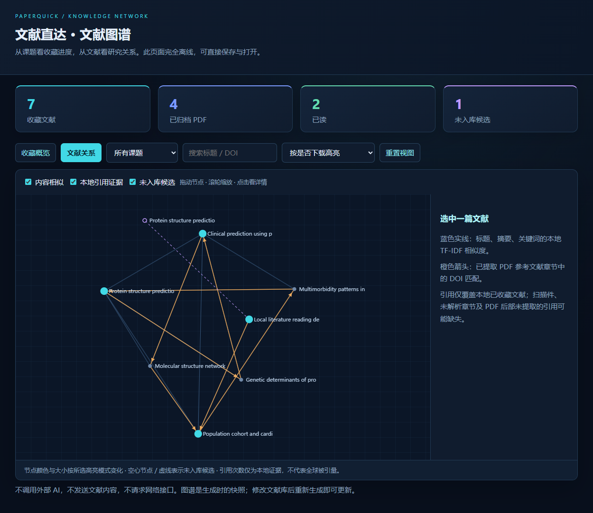

# 文献直达 3.1 · 本地文献工作区

双击 `文献直达.exe`，顶部通过 **文献查询 / 文献分类 / 文献图谱 / 文献阅读** 四项并列导航切换；也可以使用 **打开文献库.bat** 直接进入文献分类。

界面采用深色科技配色、清晰的字重层级与留白：中文使用微软雅黑 UI，数字和英文字段使用 Windows 自带的 Segoe UI Variable 系列。启动时有约 0.3 秒的一次性淡入动画；系统关闭界面动画时自动跳过。软件图标为抱着文献的虚拟助手，静态资源已经打包，运行时不调用 AI。

本版提供完整本地工作区，检索、网页右键与自定义快捷键继续可用；没有鼠标跟随浮窗。新增批量按规则重命名、参考文献原编号、阅读区右键笔记、阅读总结弹窗和四套皮肤。完整操作见 [中英 README](README.md)。

## 1. 建课题与收藏

- 在文献库左侧点击 **新建课题**。输入课题名称，确认后自动建归档文件夹。
- 在原文查询结果中点击 **收藏 / 下载归档**，选择课题或输入新课题。
- 确认课题后自动继续：有直接 PDF 地址就下载、按命名规则归档；只有出版社 / 全文网页入口时自动打开浏览器，供登录或手动下载。已有归档 PDF 时直接复用。
- 右键文献 → **下载原文（打开下载页面）**：直接打开已知 PDF；没有 PDF 时读取对应原文页面的下载元数据，确认 DOI / 标题匹配后跳转真实 PDF 地址。遇到登录或验证时停留在对应原文页面，不猜测地址。底部“下载原文”同样打开网页。
- 右键 **下载并自动归档**：查找开放版本，下载并按当前主课题和命名规则归档。已有 PDF 时复用；未能唯一匹配的标题候选需要在查询页核对。
- 机构登录页面需要先在浏览器下载。回到文献库，选中条目 → **关联已下载 PDF**。
- **导入 PDF** 支持多选；**导入文件夹** 会读取子目录中的 PDF。文件复制到文献库，保留原文件。

一篇文献可以关联多个课题，但 PDF 只在主课题文件夹中保存。选中条目 → **分配课题**：选“是”设为主课题并移动托管附件，选“否”仅增加标签。重复文件依据 SHA-256 识别；同名不同文件添加编号，不覆盖。

PDF 标题、作者、年份与 DOI 从本机文件提取，未识别的内容可用 **编辑信息** 补充。扫描件不自动 OCR；识别结果需核对。双击条目或点击 **打开 PDF**，进入软件内的文献阅读页。批量选择条目可标记已读 / 未读。

## 2. 自动命名

点击 **命名规则**。在“全部文献”视图中设置全库默认规则，在指定课题中设置课题专属规则。

默认：`{年份}_{第一作者}_{标题}`

可用字段：`{年份}`、`{第一作者}`、`{标题}`、`{DOI}`、`{课题}`；也支持 `{year}`、`{author}`、`{title}`、`{doi}`、`{project}`。

例如：`{课题}_{年份}_{第一作者}_{标题}`。可直接插入空格、下划线等分隔符；标题长度可设为 20–120 个字符。Windows 禁用字符自动替换，总文件名长度受限，同名文件自动加编号。

- **保存（用于后续导入）**：新文件使用新规则，现有附件不立即重命名。
- **预览并批量应用**：先看旧名 / 新名样例，再对当前范围所有托管 PDF 应用规则。课题范围中的跨课题条目仍按各自主课题规则归档。
- 原始导入文件保持不变。改名与归档日志保存在 `library.sqlite` 的 `events` 表中；条目与附件通过稳定 ID 关联。

## 3. 离线图谱

点击顶部 **文献图谱**，在软件主窗口查看收藏概览与文献关系。点击 **导出离线网页** 可在默认浏览器打开本机 HTML 文件：

软件内的新交互：默认显示 80 篇，用横向 **显示数量** 滑条调节；优先显示库内文献与连接较多的节点，通过本地力导向布局排布。参考了 [Cytoscape.js](https://js.cytoscape.org/#cy.fit) 的集合适配与 [Sigma](https://www.sigmajs.org/how-to/interactivity/camera-viewport/) 的相机交互；当前实现使用本地画布，不依赖在线图谱脚本。

- 单击节点查看详情并突出关联边；双击节点或点击 **聚焦关联**，只看它及直接邻居。
- 空白处拖动平移，滚轮围绕鼠标缩放；按 **Shift** 拖框选择区域并放大。
- **适应窗口** 显示当前子图，**返回全图** 退出局部聚焦，滑条仍决定显示上限。
- 点击收藏概览中某课题的横条，进入该课题网络。
- 导出的离线 HTML 保留原网页视图；上述新增交互位于软件内。

- **收藏概览**：课题分布、条目数量、已归档 PDF、已读数量。
- **文献关系**：搜索标题 / DOI、按课题筛选；拖动节点、滚轮缩放、点击节点看详情。
- 蓝色关系：标题、摘要与关键词的本地 TF-IDF 内容相似度；每篇保留至多 4 个最近邻候选（可能被其他文献连入更多边）。相似关系不能视作引用。
- 橙色箭头：已提取 PDF 的参考文献章节中，匹配本地已收藏文献 DOI 的引用证据。

图谱完全离线，无 CDN、外部 AI 或在线 API。它是生成时的快照，修改文献后点击刷新即可更新。引用图不是完整外部引文网络：导入时读取 PDF 前后各 12 页，阅读时通常读取全文；超过 100 页的文件读取开头 8 页和最后 60 页。扫描件、复杂排版、缺失 DOI 可能漏检；文本匹配也需核对。

### 未入库候选与自定义高亮

- 选中 **显示未入库候选（虚线）**，从本地参考文献中发现还没收藏的文献。候选节点为空心，关系线为虚线，不计入已收藏数量。
- 候选标题可能是启发式提取，需核对；有 DOI 时优先使用 DOI 检索。选择候选节点 → **查找选中文献原文** → 到查询页核对结果 → 下载、按课题归档并阅读。也可先收藏到课题。
- 不在线抓取整张引文网络，不从 AI 生成“可能关系”。候选来自本地参考文献证据，最多展示 400 个未入库节点；不是已验证的全部引用关系。
- **节点高亮** 支持：是否下载、阅读次数、本地被引用次数、自定义组合权重。颜色深浅与节点大小随分数变化。
- **自定义颜色 / 权重** 可设置低值、高值、候选颜色和三项权重。保存后下次打开仍保留，导出的 HTML 也继承这份配置。
- 阅读次数按每次在软件中打开该文献 PDF 计数，翻页不增加次数；不自动标记已读。引用次数仅统计本地已识别的引用入边，不是全球引用量。

## 文献阅读与笔记

- 首次打开自动适合页面宽度；支持翻页、输入页码跳转、缩放和拖动页面。拖动阅读区与侧栏之间的分隔线可以调整笔记宽度。
- 右侧 **笔记编辑** → **编辑 / 新段落** 可直接输入；支持右键剪切、复制、粘贴、全选、撤销和重做，`Ctrl+S` 保存，停止输入约 1.2 秒自动保存。
- **研究笔记模板** 插入研究问题、方法数据、主要发现、局限与课题联系；**插入页码** 记录当前页。
- 选择 **框选高亮 / 框选批注 / 复制文字** 后，在 PDF 内容上拖框。高亮有黄、绿、蓝、粉四色；批注可保存摘录及自己的文字。扫描件没有文本层时仍可做区域批注。
- **高亮 / 批注** 列表支持双击定位、编辑和删除；也可双击 PDF 上的标记编辑。**加书签** 保存当前页位置。
- 高亮、批注、书签按附件与页码保存在本地数据库；缩放、文件重命名、重新打开后仍可定位。原 PDF 文件不改写，复制 PDF 到别的软件不会附带这些批注。
- **导出笔记** 将笔记、摘录、批注、页码导出为 Markdown 或文本。扫描件文字复制需要原 PDF 具备可提取文本，本版不含 OCR。

1. 在文献分类或图谱中点击 **打开 PDF**，统一进入 **文献阅读** 页。查询结果的 PDF 按钮会先完成选择课题、下载归档，再进入阅读页；机构登录页面仍需手动下载后关联。
2. 支持上一页 / 下一页、放大 / 缩小和滚轮查看当前页；PDF 在本机逐页渲染，不上传文件。
3. 右侧 **阅读笔记** 支持编辑与自动保存（停止输入约 1.2 秒后保存），也可手动保存、插入当前页码。切换文献与退出软件前会保存未完成的笔记。笔记保存到该条目的 Notes 字段，可进入 EndNote 交换预览。
4. 点击 **参考文献侧栏**，单独唤出参考文献列表。它可以独立移动，方便一边阅读一边查引用。提取标题需要人工核对；扫描件和复杂双栏版式可能漏检。
5. 选中参考文献 → **查找原文 / 下载归档**：将 DOI 或提取标题交给现有检索页；联网查到结果后，沿用课题分类、命名和下载归档流程。**先收藏到课题** 可在没有原文时先记录条目。

本版使用渲染页面和独立文字笔记；尚不提供在 PDF 原文件中写入批注或跨页全文搜索。此限制不影响本地笔记和参考文献检索流程。

## 4. EndNote 22.3 兼容与同步预览

**当前版本支持离线读取、双方修改比较、冲突选择与 XML 交换；尚不支持自动写回已有 EndNote 条目，也不声称完成全自动双向同步。**

1. 在 EndNote 中保存并关闭要读取的库。确保 `.enl` 与同名 `.Data` 文件夹在同一位置。
2. 在文献库点击 **EndNote 同步**，选择 `.enl`。
3. 预览显示新增、双方修改、无需修改以及缺失条目。
4. **仅导入新增条目到本地**：复制条目与可访问的 PDF，不改写 EndNote 源库。EndNote 中相同 DOI 的不同记录保持独立身份。
5. 后续再次选择同一库，工具依据原始记录号与上次基线比较标题、作者、年份、DOI、期刊、摘要、关键词、笔记和课题标记。双方修改同一字段时必须逐项选保留版本。
6. **应用到本地 / 导出 EndNote 交换包**：读取双方已选定内容到本地，并生成下面的文件。

| 文件 | 用途 |
| --- | --- |
| 仅新增文献.xml | EndNote **文件 → 导入 → 文件**，导入选项选择 **EndNote generated XML**，先在测试库验证，按需丢弃重复项 |
| 修改清单.html / .json | 已有 EndNote 条目按记录号人工核对更新；**不要通过导入完整 XML 替代已有条目的更新，会产生重复项** |
| 完整文献库.xml | 主要字段交换与新建空白测试库导入；不保留原记录号、原生分组和全部扩展字段 |
| 操作说明.txt | 包内操作步骤 |

XML 的 PDF 附件链接指向本机托管文件。在 EndNote 中检查 PDF 是否可打开，按需要让 EndNote 复制到自己的 `.Data` 文件夹。相同 DOI 可用于首次关联已有本地记录；无 DOI 新条目的自动反向关联仍有限，重新导入时需人工核对。

课题使用关键词行 `PaperQuick课题:课题名称` 交换；EndNote 中修改该关键词后可读取回本地。原生 Group / Group Set 暂不映射。阅读状态属于本地文献库，暂不同步 EndNote。缺失或删除记录只提示，不自动传播删除。

为什么不直接写 `.enl`：实测的 EndNote 22.3.1 库具有专有排序函数及索引。当前普通 SQLite 写入不能可靠维护这些数据，因此预览版只读源库，使用 XML 与变更清单交换。全自动双向写回还需要验证可靠的 EndNote 原生更新路径。

## 5. 文件与备份

### 后台、托盘与 Windows 登录启动

- 主窗口右上角 `X`：先保存笔记，再隐藏到托盘；主窗口隐藏时不占任务栏。
- 双击托盘图标恢复主窗口；右键可以打开文献分类、设置、自定义快捷键，或 **退出程序**。
- **设置 → 登录 Windows 后启动到后台托盘** 可随时开关。软件仅写入当前 Windows 用户的启动项；不需要额外账号。
- 重复打开软件或快捷键查询会唤回同一实例；查询正在执行时，新查询依次排队。
- 后台空闲时降低界面检查频率，不自动检索或重算图谱；待机后恢复继续使用。下载遇到休眠断网失败时可手动重试。
- 若托盘启动失败，主窗口保持可见，避免无法唤回。彻底退出时会保存笔记；正在归档时先等待完成。

默认文献库位于软件旁的 **本地文献库** 文件夹：`library.sqlite` 保存记录与日志，`papers` 保存课题 PDF，`collection-graph.html` 保存离线图谱。点击 **文献库文件夹** 可直接打开。

从托盘完整退出软件后，复制整个 **本地文献库** 文件夹即可备份；恢复时将完整文件夹放回软件旁。不要只复制数据库而遗漏 PDF。交换包和图谱包含文献标题与笔记，请自行决定是否分享。

本地整理、元数据提取、图谱和 EndNote 比较不联网；查找原文与下载 PDF 仍需联网。直接 PDF 下载上限为 100 MB，不自动处理机构登录或网页验证。

## English quick guide

New desktop controls: drag the graph's node-count slider, double-click a node to focus its neighborhood, pan empty space, zoom at the cursor, or Shift-drag a region to zoom in. Reader notes are editable with autosave, undo/redo and export; area highlights, comments and bookmarks are stored locally per attachment and page. The original PDF is not modified.

Right-click **下载原文（打开下载页面）** opens the actual known PDF or verified article download page. Choose **下载并自动归档** for background downloading into the project folder. Closing the main window hides it to the tray after saving notes; double-click the tray icon to restore, or choose **退出程序** to exit. Windows sign-in startup is configurable in Settings and starts in the tray.

Open `文献直达.exe` and use the parallel **文献查询 / 文献分类 / 文献图谱 / 文献阅读** tabs (Search / Library / Graph / Reader), or run `打开文献库.bat`.

1. Create a research project. Click **收藏 / 下载归档** and confirm a project: a direct PDF is downloaded and named automatically, or the publisher page opens for manual download. In the library, right-click a record → **下载原文** to find and archive its full text. Attach a manually downloaded PDF with **关联已下载 PDF**.
2. **导入 PDF / 导入文件夹** copies PDFs into managed project folders. Originals are preserved. Multiple project associations share a primary storage folder. Duplicate files are detected by SHA-256; filename collisions never overwrite files.
3. **命名规则** configures the default or project-specific template. Tokens: `{year}`, `{author}`, `{title}`, `{doi}`, `{project}`. Preview before applying to existing managed files.
4. **文献图谱** shows collection statistics and a relationship graph inside the same app window. **导出离线网页** exports a self-contained HTML view. Both use local TF-IDF similarity links and DOI citation evidence extracted from local References sections. Hollow candidates and dashed links represent references not yet collected. Highlight by downloads, reading sessions, local incoming citations, or custom colors and weights. No AI, API or CDN is used; citation coverage is incomplete.
5. **文献阅读** renders PDFs locally, provides autosaved Notes and a detachable References panel. PDF actions from the library, graph and search results lead here (search PDFs are downloaded and archived first). Reference entries can be searched online using the existing lookup tool, then classified and downloaded. Reading sessions count each opening, not each page turn. Scanned documents and complex layouts may not yield usable references.
6. **EndNote 同步** reads a closed SQLite-format `.enl` and paired `.Data`, previews changes and resolves field conflicts. It imports new records and exports EndNote XML plus a change report. **Automatic updates to existing EndNote records are not implemented.** Import only the new-record XML into a test library; update existing records manually from the report. Full XML is for a new library, not in-place updates.
7. Projects are exchanged as `PaperQuick课题:` keyword lines. Native EndNote groups, reading status and deletion propagation are not synchronized. PDF XML links use local absolute paths and must be checked in EndNote.

Back up the entire **本地文献库** folder after fully exiting from the tray. See the bilingual README for v3.1 batch renaming, numbered references, reader context notes, recap popup and themes.
